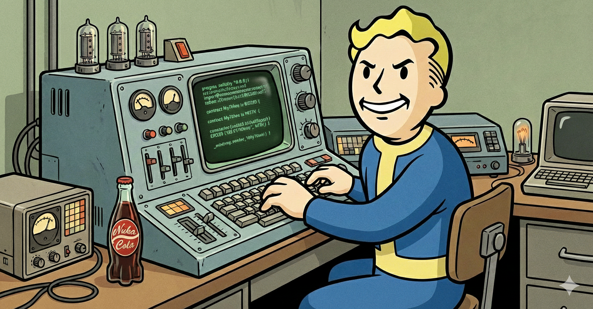
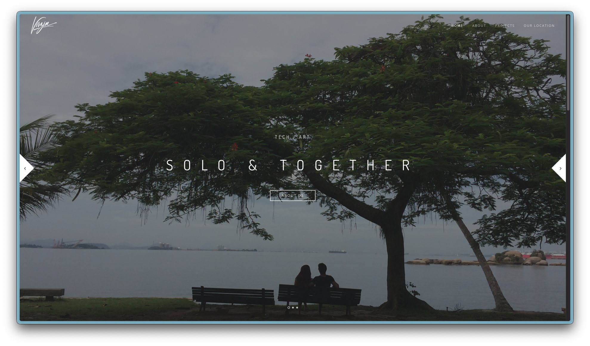
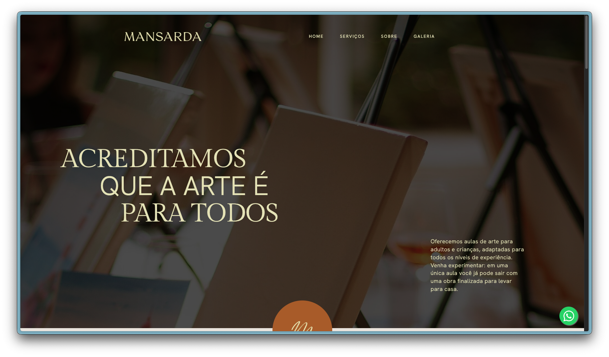

# About Me

Although my current role revolves around analyzing and specifying products as well as handling operational tasks, software development remains one of my biggest passions. In my free time, I dedicate myself to personal projects, either to learn something new or to experiment with technologies and solutions that can improve the projects I’m currently involved in.

It is important to note that several of my repositories are private due to the sensitive nature of the data and intellectual property involved. As such, some projects are referenced in this document solely for illustrative purposes and cannot be shared publicly.

## :test_tube: Alchemy University Final Project

As part of my blockchain development learning at Alchemy University, I'm working on a [conclusion project](https://github.com/avirzin/Rendex) demonstrating how investments could work in Web3 using an Oracle for real-world data. This is giving me hands-on experience with smart contracts and decentralized applications.

## :robot: Google AI Agent

Inspired by Google's AI courses, [this project](https://github.com/avirzin/arbitra.git) is an attempt to implement an agent that leverages Google AI tools to help solve payment dispute problems. It's an ongoing exploration at the intersection of AI and fintech.

## :art: One-pager websites

I also maintain a couple of basic static websites hosted on S3 Buckets, showcasing some of our projects and serving as a public-facing portfolio.

<table>
  <tr>
    <td>
      
    </td>
    <td>
      
    </td>
  </tr>
</table>

## :chart_with_upwards_trend: Studying Quantitative Trading

I'm revisiting my [knowledge of mathematics and quantitative finance](https://github.com/avirzin/becoming_quant) by following a comprehensive Udemy course on quantitative trading. This helps me understand modern trading techniques and financial modeling.

## :gem: UNIT Fractal Monetary Ecosystem

[The UNIT project](https://unitfoundation.org/), proposed by the Unit Foundation, introduces a fractal monetary ecosystem designed to facilitate cross-border trade and settlements without relying on a single national currency.

According to publicly available materials published by the Unit Foundation, UNIT is conceived as a gold-anchored global unit of account whose value is referenced to a basket of assets measured in gold terms. Each UNIT token represents a proportional share of a reserve basket that includes at least 40% gold, with the remainder composed of fiat currencies that are freely convertible into gold.

My current activities involve conducting hypothesis testing to assess the coherence of the core UNIT design assumptions—fractal reserve replication, gold-anchored pricing, and decentralized minting—under realistic operational scenarios, as well as modeling ecosystem behavior under stress conditions.

## :flying_saucer:  Aerial Mobility

During my time at Flapper (the largest private aviation marketplace in Latin America), I focused on data analysis and operational insights, utilizing tools such as Mapbox and Deck.gl. My work included analyzing charter flight requests and identifying trends.

At some point, I've been exploring future eVTOL operations through projects like Hoverfly, which visualizes eVTOL trajectories:

